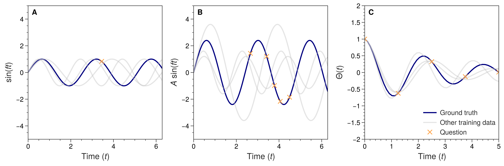

# Questioning the question

In this work, we explore the properties of a beta-VAE. We explore when a latent representation is found in which the degrees of freedom of three analytical datasets are found. The work is published in Physical Review Research: 

> Joeri Lenaerts and Vincent Ginis, "Questioning the question: exploring how physical degrees of freedom are retrieved with neural networks" (2022)  Physical Review Research, 4, 023206 https://journals.aps.org/prresearch/abstract/10.1103/PhysRevResearch.4.023206

## Datasets

There are three analytical datasets shown in the figure below. The first is a dataset of a sine function where only the frequency changes, this is given by

$$ y = \sin(ft), \quad \text{for} \quad t \in [0, 2\pi]. $$

In this case, the one degree of freedom is the frequency f. In the second dataset, also the amplitude is added as a degree of freedom. We get 

$$ y = A \sin(ft), \quad \text{for} \quad t \in [0, 2\pi]. $$

We now have two degrees of freedom, the frequency f and the amplitude A. Finally, the third dataset is based on the analytical formula for a damped harmonic oscillator. We get

$$ \Theta(t) = \exp(-\frac{b}{2t}) \cos( \sqrt{ \kappa - \frac{b^2}{4} } t), \quad \text{for} \quad t \in [0, 5]. $$

The two degrees of freedom are b and kappa. The results are stored in a folder for each dataset.

## Thanks for reading

